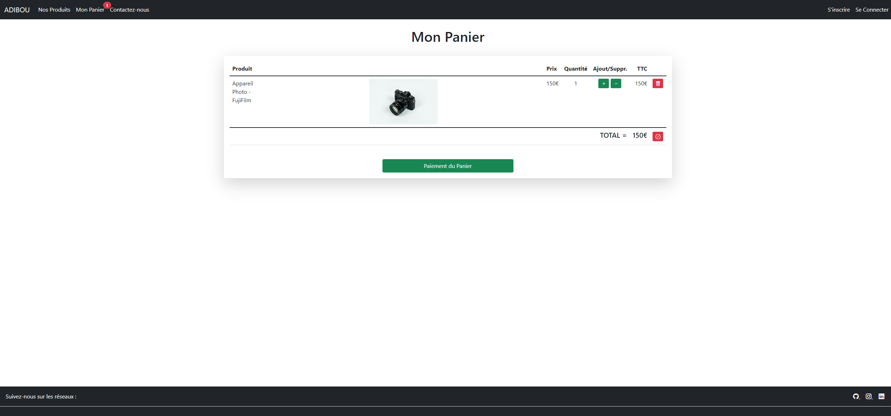

# E-Commerce with Symfony

## Explination of the project

The Project consists in creating an e-commerce site with the PHP framework -> **Symfony** !

The Project started on 03/05/2022, and the submission date was set for on 13/05/2022.

## Objectifs

**Front-End** :
*   Login and Register page (With MailDev for the registration mail);
*   Cart page
*   Profil page
*   Products page with the details of the products
*   New and Edit Product page
*   Contact page

**Back-End** :
*   EasyAdmin with CRUD
*   Add Role_Admin  
*   Manage Security access

> **Note :** **Objectives** can be found in the specification directory.

## How to install and run the program ?

In order to use our program, you have to clone the repo :

```console
git clone https://github.com/KevOneRedOne/E_commerce_Symfony
```

Then :
```console
cd E_commerce_Symfony/
composer install
```

Moreover, you have to import the database on your environement XAMPP or WAMPP. The datebase can be found on database directory.

Finally, you can start the server Symfony and the server Maildev :

On the first command prompt

```console
symfony server:start
```

On the second command prompt

```console
maildev
``` 
<hr>

## Badges

Deployment in progress...

<hr>

## Visuals
### Screenshots
#### HomePage


#### Products


#### Details of the Product


#### Cart


#### BackOffice - admin


<hr>